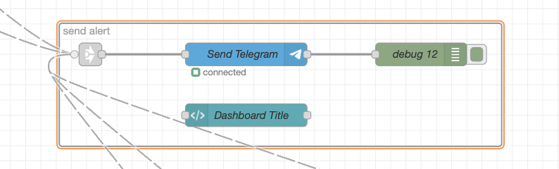
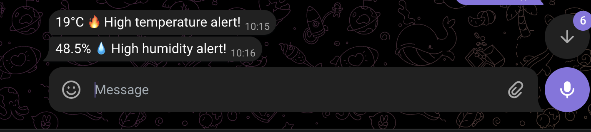

# Node-RED Flow Documentation

This folder contains the official Node-RED flow configuration for the IoT Environmental Monitoring system. The flows are organized into several logical steps to handle data ingestion, processing, visualization, and alerting.

## Node-RED Step-by-Step Flow

### 1. MQTT Climate Streams (flow1)
This flow is responsible for subscribing to the MQTT topics and routing data to the dashboard elements.

- **Subscribers:** Listens to `ProIT_IoT/Ravi/temp`, `ProIT_IoT/Ravi/humi`, and shared topics `ProIT_IoT/+/temp`, `ProIT_IoT/+/humi`.
- **Visualization:** Data is sent directly to "Local Temperature" gauge, "Local Humidity" gauge, and historical line charts for the shared ProITD data.

### 2. Local Data Publication (flow2)
A dedicated flow for publishing local sensor readings to the MQTT broker.

- **Purpose:** Ensures that temperature and humidity readings from the local ESP32 are available on the network for other subscribers and processing nodes.

### 3. Telegram Send Flow
The integration point for sending automated alerts to the Telegram bot.

- **Components:** Uses a specialized Telegram sender node configured with the Bot Token and Chat ID.
- **Trigger:** Activated by various alert flows (Temperature, Humidity, Environmental Analysis).

### 4. Push Notification Alerts
The end result of the alert system as seen by the user.

- **Features:** Real-time mobile notifications for high/low thresholds.
- **Example:** Screenshot shows typical "High temperature alert!" and "High humidity alert!" messages with current values and timestamps.

### 5. Humidity Alert Logic (Humi Alert Flow)
Detailed logic for monitoring humidity levels and triggering alerts.

- **Process:** Checks the incoming humidity range. If it exceeds 42% or falls below 30%, it generates a formatted message, sets the alarm state, and passes the message to the Telegram sender.

### 6. Environmental Analysis (Environmental Flow)
Advanced processing flow for calculating complex environmental metrics.

- **Functionality:** Tags incoming temperature and humidity data, combines them, and uses a function node to calculate the Dew Point using the Magnus-Tetens formula.
- **Output:** Passes the enriched data to a template for message formatting.

### 7. Comprehensive Telegram Report
The final output of the Environmental Analysis flow.

- **Metrics Included:**
  - 🌡️ **Temperature**
  - 💧 **Humidity**
  - ❄️ **Dew Point**
  - 📊 **Absolute Humidity**
  - 📉 **Depression**
  - 📍 **Location Info**
- **Timestamping:** Every report includes a precise timestamp of the analysis.
