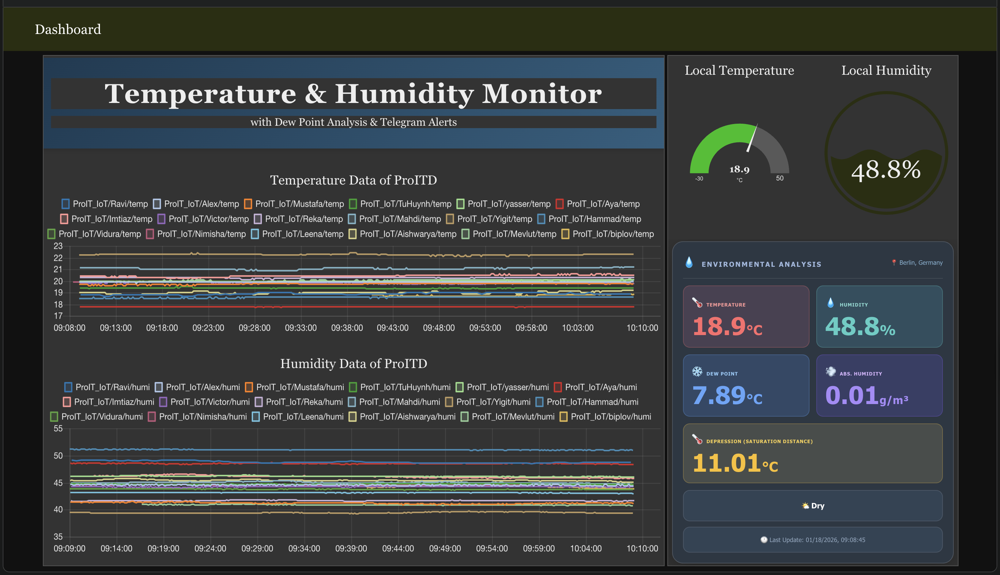
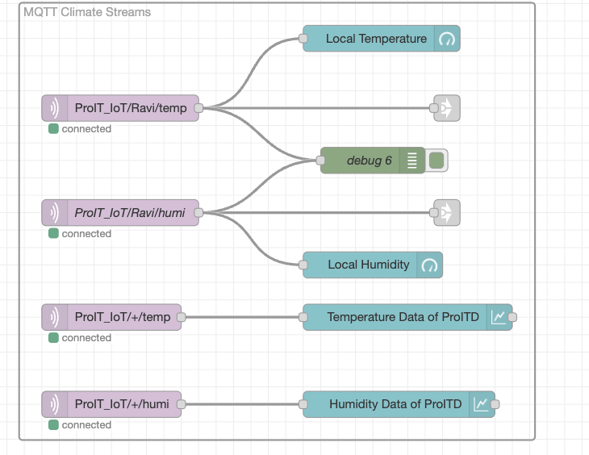
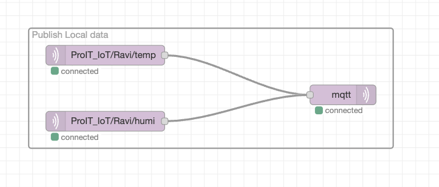
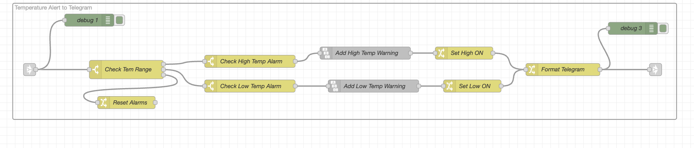

# ProIT_WS2526_IoT_Ravi_FinalProject

## IoT-Based Temperature, Humidity & Environmental Monitoring and Alert System

IoT Project winter semester 2025/26

**Author:** Ravi Kumar Thekare

---

## Project Overview

This project implements a comprehensive IoT environmental monitoring system that measures temperature and humidity in real-time using a DHT22 sensor and ESP32. It calculates advanced metrics like **Dew Point**, **Absolute Humidity**, and **Saturation Depression** via Node-RED, providing automated Telegram alerts.



---

## Components

### Hardware
* **Microcontroller:** ESP32 Development Board
* **Sensor:** DHT22 Temperature & Humidity Sensor
* **Processing Unit:** Raspberry Pi 
* **Power Supply:** USB 5V

### Software
* **Node-RED Ecosystem**
   * **Telegram Integration:** `telegram-in`, 
   * **Dashboard UI:** `ui_gauge`, `ui_chart` (Line Chart), `ui_template` (Glassmorphism)
   * **MQTT & Logic:** `mqtt-in`, `mqtt-out`, `function`, `switch`, `change`, `link-in`, `link-out`, `string`, `delay`
* **Mosquitto MQTT Broker** (Local installation on Raspberry Pi)

---

## Repo Structure

```
.
├── Documentation/
│   ├── images/                 # Project screenshots and diagrams
│   ├── Reports/                # PDF project reports and documentation
│   └── README.md               # Documentation overview
├── Hardware/
│   ├── ESP32/                  # Hardware docs and wiring
│   └── README.md               # Hardware overview
├── uPython/
│   ├── boot.py                 # Main ESP32 logic
│   ├── umqttsimple.py          # MQTT library for MicroPython
│   └── README.md               # firmware overview
├── Node-RED/
│   ├── README.md               # Node-RED overview
│   ├── function-nodes/         # Custom JavaScript logic
│   ├── template-nodes/         # Dashboard UI HTML
│   └── telegram_alert_flow.json # Complete Node-RED flow
├── RaspberryPi/
│   └── README.md               # Raspberry Pi overview & Setup
└── README.md
```

---

## Directory Navigation

*   📂 [**Documentation**](Documentation/README.md) - Images, presentations, and guides.
*   📂 [**Hardware**](Hardware/README.md) - Wiring and physical setup.
*   📂 [**uPython**](uPython/README.md) - ESP32 MicroPython firmware.
*   📂 [**Node-RED**](Node-RED/README.md) - Flows and dashboard configuration.
*   📂 [**RaspberryPi**](RaspberryPi/README.md) - Server setup, MQTT installation, and SSH guides.

---

## System Architecture

The system follows a simple IoT architecture:

```
ESP32 + DHT22  →  MQTT  →  Raspberry Pi (Node-RED)  →  Telegram Bot
   (Sensor)              (Message Broker)   (Processing)      (Alerts)
```

**Data Flow:**
1. **Sensing:** ESP32 reads temperature and humidity from DHT22 every 30 seconds.
2. **Transmission:** Data is published to Mosquitto MQTT topics on the Raspberry Pi.
3. **Ingestion:** Node-RED subscribes to MQTT streams and routes data to UI and processing nodes.
4. **Analysis:** Calculates **Dew Point**, **Absolute Humidity**, and **Saturation Depression**.
5. **Visualization:** Dashboard displays live gauges, historical trends, and complex environmental metrics.
6. **Reporting:** 
   - **Immediate:** Separate alerts sent to Telegram as soon as temp/humi thresholds are breached.
   - **Daily:** A consolidated "Environmental Analysis" report sent once per day.


---

## Environmental Metrics & Formulas

To provide a deeper understanding of the environment, the system calculates several advanced metrics using the raw data from the DHT22 sensor:

### 1. Dew Point ($T_d$)
**Description:** The Dew Point is the temperature to which air must be cooled to become saturated with water vapor. 
*   **Why it matters:** It is a much more accurate measure of how "humid" it feels than Relative Humidity. While Relative Humidity changes as the temperature changes, the Dew Point stays constant unless moisture is added or removed from the air.

**Formula (Magnus-Tetens Approximation):**
$$ \alpha(T, RH) = \frac{17.27 \times T}{237.7 + T} + \ln\left(\frac{RH}{100}\right) $$
$$ T_d = \frac{237.7 \times \alpha}{17.27 - \alpha} $$

### 2. Absolute Humidity ($AH$)
**Description:** Absolute Humidity measures the actual weight of water vapor in a specific volume of air, regardless of the temperature. It is expressed in grams of moisture per cubic meter of air ($g/m^3$).
*   **Why it matters:** Relative Humidity (%) can be misleading because warm air can "hold" more water than cold air. Absolute Humidity gives you the "true" amount of water present. This is crucial for applications like wood drying, document storage, or preventing mold.

**Formula:**
$$ AH = \frac{6.112 \times \exp\left(\frac{17.67 \times T}{T + 243.5}\right) \times RH}{461.5 \times (T + 273.15)} $$

### 3. Dew Point Depression ($D$) — *(also known as Saturation Depression)*
**Description:** This is the difference between the current air temperature and the Dew Point.
*   **Why it matters:** It tells you how close the air is to being "full" of water. 
*   **Interpretation:**

*   **Formula:** $D = T - T_d$

---

## Data Calculation Logic (Node-RED Implementation)

The following JavaScript logic is used within a **Node-RED Function Node** to process the raw sensor data and calculate the metrics shown above:

```javascript
// Input: temperature (T) and relative humidity (RH)
var T = msg.payload.temperature;
var RH = msg.payload.humidity;

// 1. Calculate Dew Point (Magnus-Tetens)
var a = 17.27;
var b = 237.7;
var alpha = ((a * T) / (b + T)) + Math.log(RH / 100.0);
var dewPoint = (b * alpha) / (a - alpha);

// 2. Calculate Absolute Humidity (g/m³)
var e = Math.exp((17.67 * T) / (T + 243.5));
var absHumidity = (6.112 * e * RH) / (461.5 * (T + 273.15));

// 3. Calculate Dew Point Depression
var depression = T - dewPoint;

// Output result
msg.payload = {
    dewPoint: dewPoint.toFixed(2),
    absoluteHumidity: absHumidity.toFixed(2),
    depression: depression.toFixed(2)
};
return msg;
```

---

## Key Features

✅ **Real-time Environmental Monitoring**
   - Precise Temperature & Humidity measurement
   - Automated **Dew Point** calculation (Magnus-Tetens)
   - Real-time **Absolute Humidity** & **Saturation Depression** monitoring

✅ **Smart Alerting System**
   - **Immediate Temp Alerts:** High (>25°C) or Low (<10°C) notifications.
   - **Immediate Humi Alerts:** High (>65%) or Low (<30%) notifications.
   - **Scheduled Summary:** Detailed "Environmental Analysis" report delivered **once per day** to prevent spam.

---


### Sensor Reading

The following lines of code are required to read the sensor values:
```python
import dht
from machine import Pin

sensor = dht.DHT22(Pin(2))
sensor.measure() 
mytemp = sensor.temperature()
myhumi = sensor.humidity()
```

### WiFi Connection

A WiFi connection is established using:
```python
import network

sta_if = network.WLAN(network.STA_IF)
sta_if.active(True)
sta_if.connect('Rechnernetze', 'rnFIW625')
```

### MQTT Connection

And the connection with the MQTT broker:

#### Import MQTT Library
```python
from umqttsimple import MQTTClient
```

#### MQTT Configuration
```python
MQTT_CLIENT_ID = "Ravi"
MQTT_BROKER = "raspi3e26.f4.htw-berlin.de"
MQTT_PORT = 1883
MQTT_TOPIC_TEMP = "ProIT_IoT/Ravi/temp"
MQTT_TOPIC_HUMI = "ProIT_IoT/Ravi/humi"
```

#### Create MQTT Client
```python
client = MQTTClient(MQTT_CLIENT_ID, MQTT_BROKER, port=MQTT_PORT)
```

#### Connect to Broker
```python
client.connect()
```

#### Publish Sensor Data
```python
client.publish(MQTT_TOPIC_TEMP, str(mytemp))
client.publish(MQTT_TOPIC_HUMI, str(myhumi))
```

### Main Loop

The system continuously reads sensor data and publishes every 30 seconds:
```python
while True:
    sensor.measure()
    mytemp = sensor.temperature()
    myhumi = sensor.humidity()
    
    client.publish(MQTT_TOPIC_TEMP, str(mytemp))
    client.publish(MQTT_TOPIC_HUMI, str(myhumi))
    
    time.sleep(30)  # Wait 30 seconds before next reading
```

---

## Node-Red Flow

The system logic is implemented in Node-RED through a series of interconnected flows. Each flow handles a specific part of the data lifecycle, from MQTT ingestion to Telegram alerting.

### Step 1: MQTT Climate Streams (flow1)

**How it works:** Subscribes to MQTT topics from the ESP32 and routes live data to dashboard gauges and historical charts.

### Step 2: Local Data Publication (flow2)

**How it works:** Relays local sensor data between brokers to ensure readings are reachable by both the dashboard and external subscribers.

### Step 3: Telegram Alert Sender

**How it works:** A centralized integration flow that connects all alert logic to the Telegram Bot API.

### Step 4: Temperature Alert Logic (Temp Alert Flow)

**How it works:** Monitors temperature thresholds (High > 25°C, Low < 10°C). Alerts are sent **separately and immediately** to Telegram when a threshold is breached.

### Step 5: Humidity Alert Logic (Humi Alert Flow)

**How it works:** Monitors humidity thresholds (High > 65%, Low < 30%). Alerts are sent **separately and immediately** as independent messages.

### Step 6: Environmental Analyser (Daily Report Flow)

**How it works:** Calculates advanced metrics. To prevent clutter, this comprehensive report is scheduled with a delay to be sent **only once per day**.

### Step 7: Real-time Push Notifications (Alert Result)

**How it works:** The final user experience where instant alerts appear on the mobile device via the Telegram bot.

### Step 8: Comprehensive Environmental Report (Daily)

**How it works:** A detailed snapshot of all calculated metrics delivered once per day to provide a daily environmental summary.


## Acknowledgments

- **Course:** ProIT - IoT Project (WS2526)
- **Institution:** HTW Berlin
- **Semester:** Winter Semester 2025/26

---
